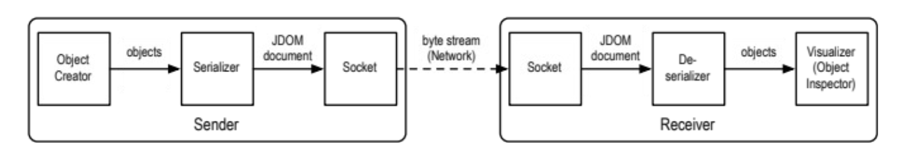

# Distributed Objects with Reflective Serialization/Deserialization

Create arbitrary objects using reflection from a collection of given classes. Send the serialized document over s socket connection. Receive the document in the server, and de-serialize it. Recreate the objects with reflection and display the information.
